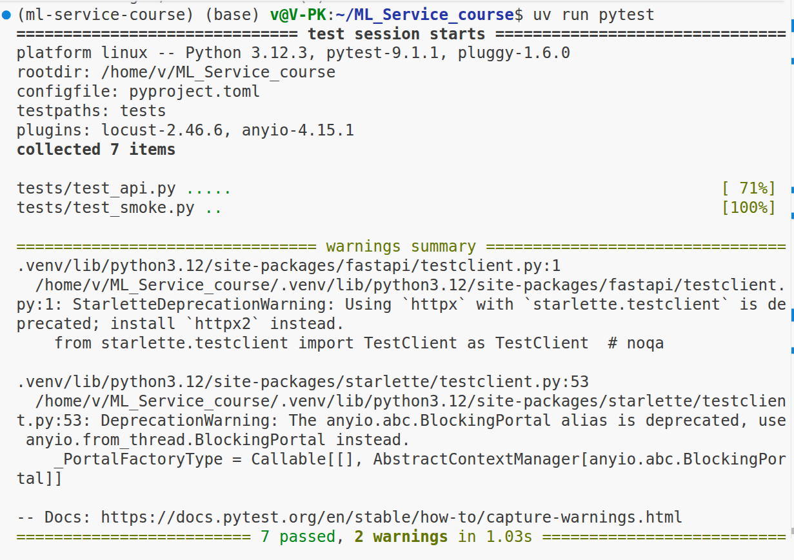
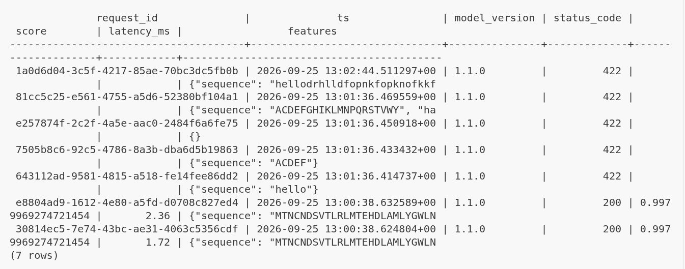
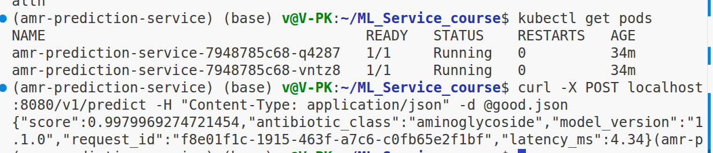
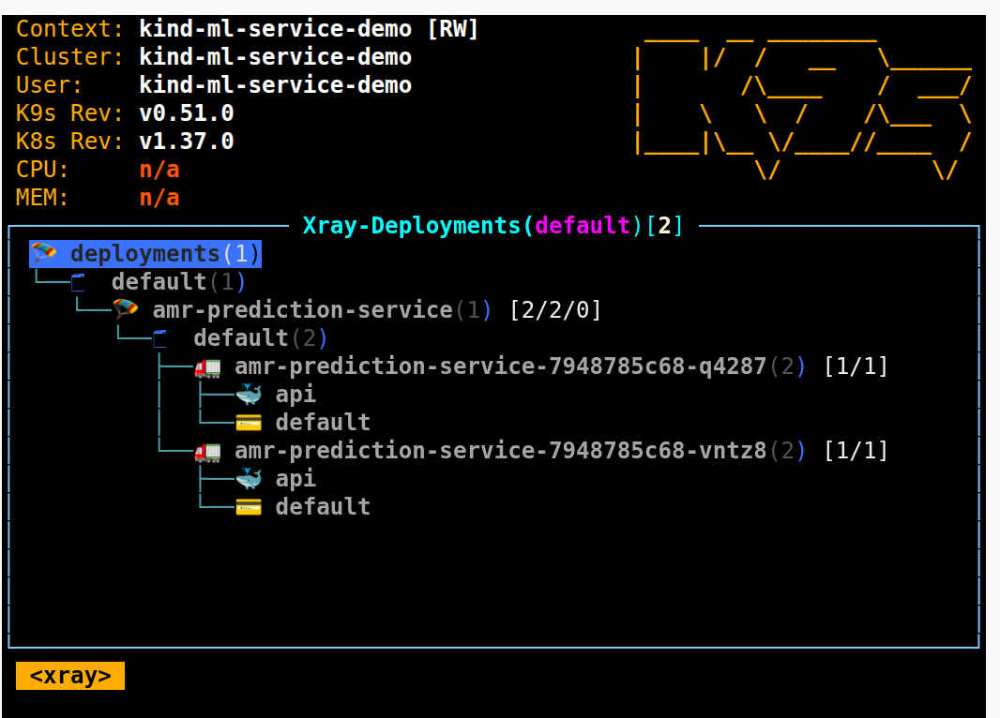

# Отчёт

Команды для воспроизведения описаны в [README.md](README.md).

## Скрины

### pytest

### SELECT из таблицы логов

### kubectl get pods и ответ /v1/predict через port-forward

### k9s

## Журнал проблем

### 1. Артефакт модели не загружался через joblib

- **Что не получилось:** сервис не мог загрузить `artifact/amr_prediction_bundle.joblib`. Токенайзер `integer_encoding` и класс `MLPModel` (`torch.nn.Module`) были объявлены в ноутбуке. pickle сохраняет только путь к ним (`__main__.integer_encoding`), а не код.
- **Текст ошибки:** `AttributeError: Can't get attribute 'integer_encoding' on <module '__main__' (<class '_frozen_importlib.BuiltinImporter'>)>`. Для torch-части: `ModuleNotFoundError: No module named 'torch'`.
- **Как починили:** отказ от кастомного кода в пайплайне. `MLPModel` заменена на `sklearn.neural_network.MLPClassifier` (те же слои, оптимизатор, batch size и seed), а кастомный токенайзер на `TfidfVectorizer(analyzer='char')`. Модель переобучена, бандл состоит загружен (коммит `refactor: replace torch MLP with sklearn MLPClassifier, char-level TfidfVectorizer`).

### 2. TLS handshake timeout при сборке образа

- **Что не получилось:** сборка не смогла скачать базовый образ `python:3.11-slim`.
- **Текст ошибки:** `failed to fetch anonymous token: Get "https://auth.docker.io/token?...": net/http: TLS handshake timeout`
- **Диагностика:** из shell `curl` до `auth.docker.io` вернул 200, до `registry-1.docker.io/v2/` вернул 401 (это нормальный ответ без авторизации). Прокси и `daemon.json` не настроены, Dockerfile корректен. Значит, причина во временной сетевой проблеме между демоном Docker и Docker Hub.
- **Как починили:** повторили сборку.

### 3. kubectl apply: недопустимое имя ресурса

- **Что не получилось:** `kubectl apply -f k8s/`
- **Текст ошибки:** `The Deployment "amr_prediction-service" is invalid: metadata.name: Invalid value: "amr_prediction-service": a lowercase RFC 1123 subdomain must consist of lower case alphanumeric characters, '-' or '.' ...`
- **Как починили:** в `metadata.name` у Deployment и Service заменен `_` на `-` (`amr-prediction-service`).

### 4. Pod'ы в Pending

- **Что не получилось:** `kubectl get pods` показывал `0/1 Pending` у всех подов, Deployment `0/2`.
- **Текст ошибки:** `FailedScheduling ... 0/1 nodes are available: 1 Insufficient memory.` 
- **Как починили:** замена на `1000Mi` (`requests` и `limits`), `kubectl apply -f k8s/`. Оба пода перешли в `Running`.
