# Changelog

Трекинг изменений проекта. Формат: [Keep a Changelog](https://keepachangelog.com/ru/1.1.0/), версии: [SemVer](https://semver.org/lang/ru/).

## [Unreleased] - 0.3.0 - реестр моделей и деплой в свой кластер

Постоянный кластер kind с платформой в [`platform/`](platform/). Один вход на порт 80, маршрут по имени хоста:

```
браузер → 127.0.0.1:80 → kind-узел :30080 → Traefik → Ingress по хосту → MLflow :5000
```

Обучение [`train.py`](src/amr_prediction/train.py) регистрирует каждую модель в MLflow. Новая версия получает алиас `challenger`, `champion` - только если гейт пропустил.

Деплой идёт в этот же кластер. Job `deploy` выполняет self-hosted runner `mlops-kind`: контейнер в Docker-сети `kind`, поэтому узел кластера ему виден по имени `mlops-control-plane`. Запускается только кнопкой Run workflow:

```
push в main:  tests → build (образ в ghcr), deploy пропущен
Run workflow: tests → build → deploy на [self-hosted, kind]: образ в узел, Secret, манифесты, smoke через Ingress
```

### Приёмка

| Изменение | Подтверждение |
|---|---|
| Платформа: kind с входом на :80, Traefik, MLflow на `mlflow.localhost` | [поды и Ingress](#поды-и-ingress), [UI MLflow](#mlflow-ui) |
| Обучение с регистрацией в MLflow и гейтом champion/challenger | [прогоны гейта](#прогоны-гейта), [реестр](#реестр-версии-и-алиасы), [прогон](#прогон-артефакт-и-параметры) |
| Сервис берёт модель из реестра по алиасу, откат модели без пересборки образа | [откат модели](#откат-модели) |
| CI/CD в свой кластер: runner в сети kind, Secret через `apply`, smoke через Ingress | [зелёный прогон](https://github.com/NorthMarshmallo/ML_service_demo/actions/runs/37231251038), [деплой в свой кластер](#деплой-в-свой-кластер) |
| Деплой по кнопке (`workflow_dispatch`) | [деплой по кнопке](#деплой-по-кнопке) |
| Версии данных в DVC, обучение на двух версиях | [версии данных](#версии-данных-в-dvc) |
| Автомасштабирование HPA по CPU, нагрузка через Ingress | [HPA](#автомасштабирование-hpa) |
| Красные прогоны деплоя: диагноз по логу и починка | [инциденты 2-6](#инциденты) |

#### Поды и Ingress

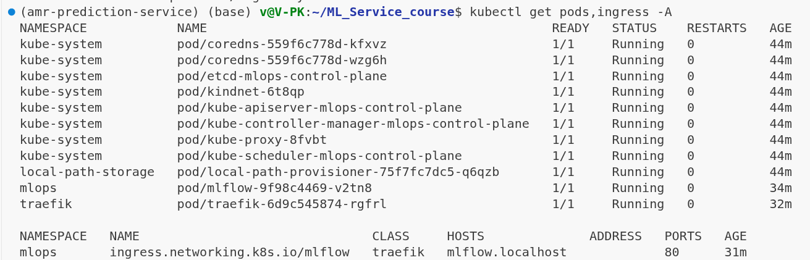

#### MLflow UI

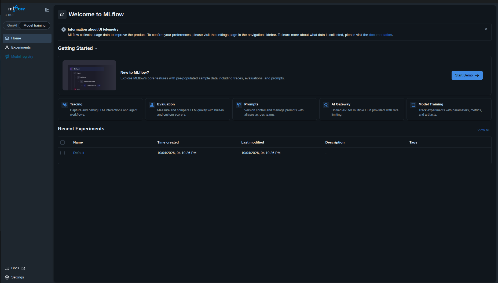

#### Прогоны гейта

| Версия | `HIDDEN_DIM` | macro F1 | Решение |
|---|---|---|---|
| 1 | 64 | 0.9256 | champion (реестр пуст) |
| 2 | 16 | 0.0088 | только challenger: второй слой из 2 нейронов, модель выродилась |
| 3 | 32 | 0.8847 | только challenger: хуже champion |
| 4 | 256 | 0.9535 | champion: лучше на 0.028 при `MIN_GAIN` 0.005 |
| 5 | 256 | 0.9533 | только challenger: данные v2, на 0.0002 хуже champion |

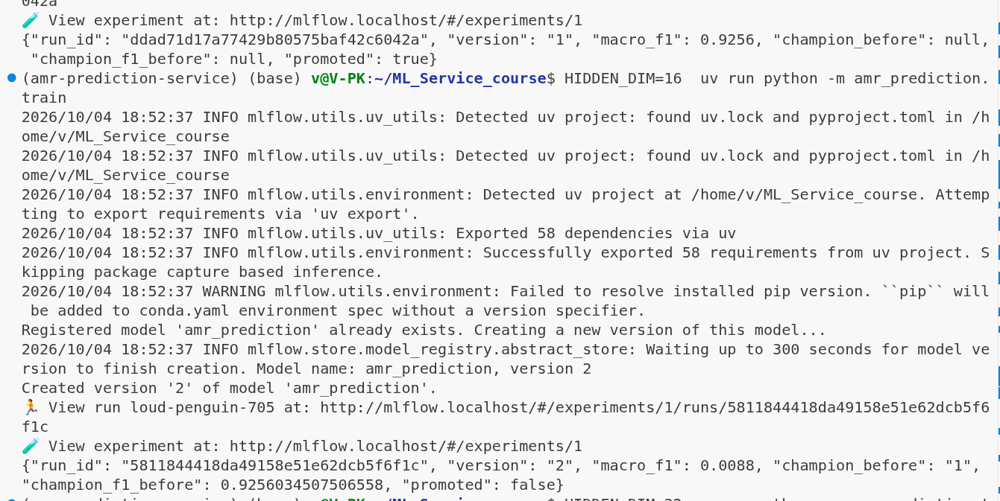

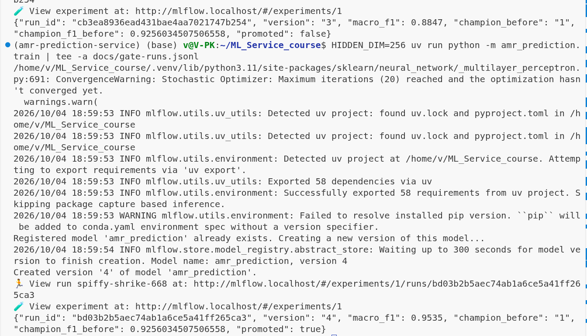

#### Реестр: версии и алиасы

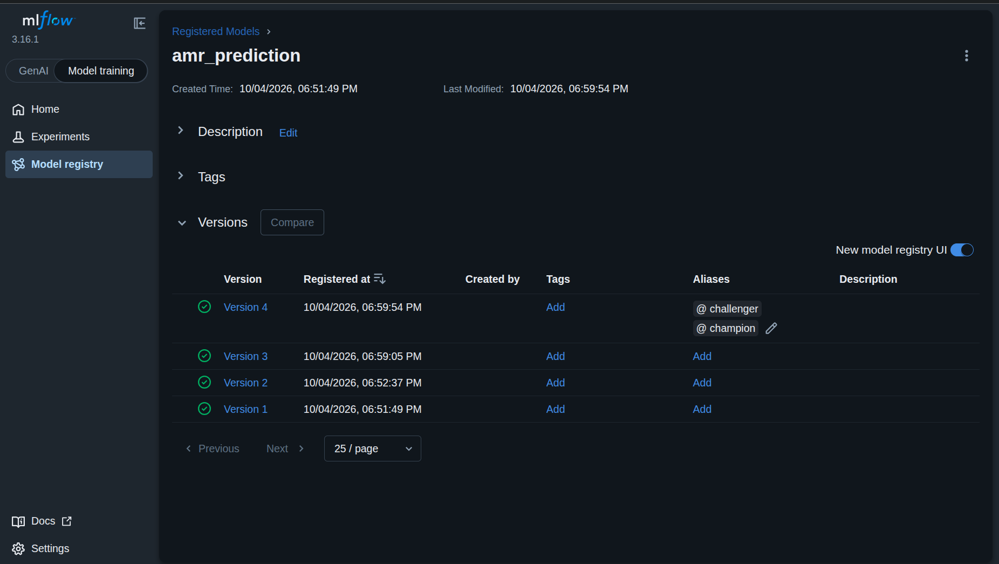

#### Прогон: артефакт и параметры

Матрица ошибок и `data_md5` у версии 4.

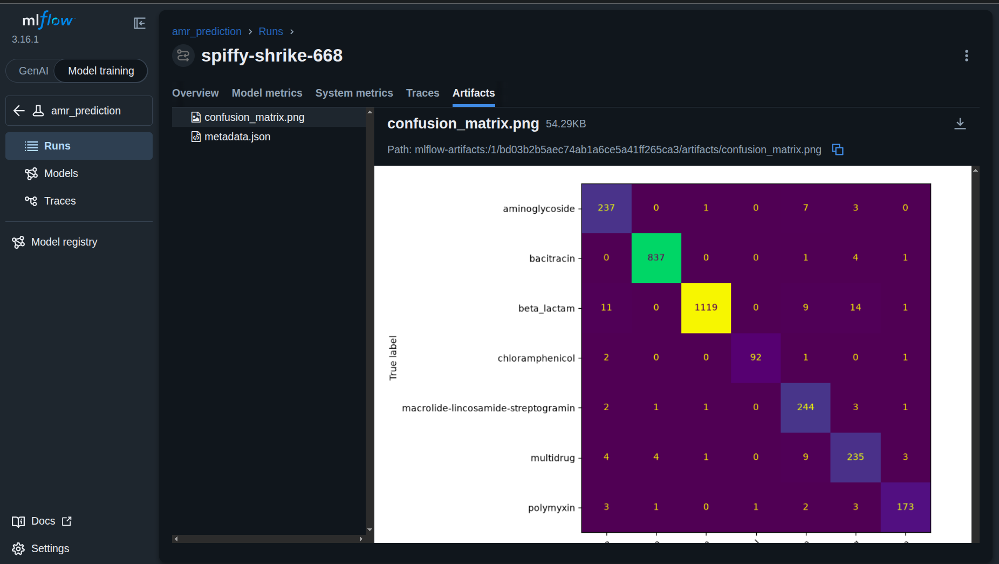

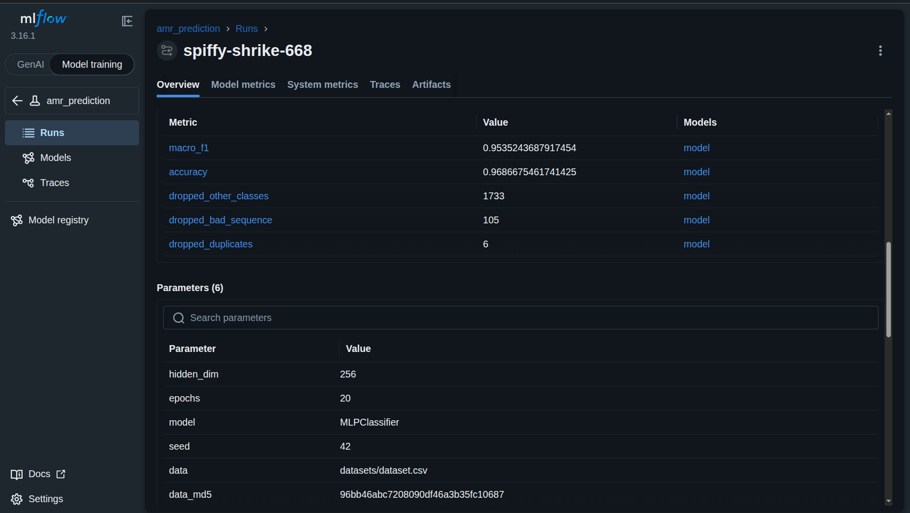

#### Откат модели

До отката сервис отдаёт версию 4:

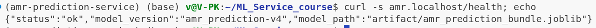

В UI MLflow `champion` перевешен на версию 1, сразу после клика `kubectl rollout restart`, затем `/health` опрашивается раз в секунду до первого ответа `amr_prediction-v1`. От клика до ответа старой версии - 36 с, образ не пересобирался.

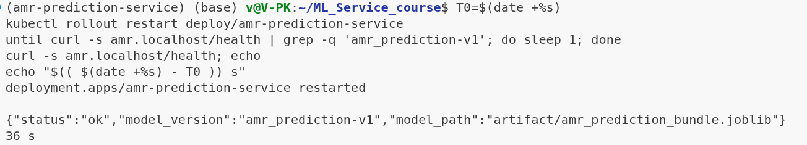

Ждать нужно именно ответа, а не конца `rollout status`. В первой попытке `curl` сразу после `successfully rolled out` вернул `amr_prediction-v4`, а через секунду уже `v1`: старый под ещё завершался, и Traefik успел отправить запрос ему. Та же гонка уронила smoke, см. [инцидент 5](#5-smoke-запрос-попал-в-завершающийся-под).

#### Деплой в свой кластер

[Зелёный прогон](https://github.com/NorthMarshmallo/ML_service_demo/actions/runs/37231251038), в логе job `deploy` на шаге `Set up job`: `Runner name: 'mlops-kind'`. Smoke проверяет три вещи через Ingress (`Host: amr.localhost` на `mlops-control-plane:30080`):

- в `/health` версия из реестра: `"model_version":"amr_prediction-v4"`;
- ответ на `good.json` осмысленный: класс `aminoglycoside` с `score` > 0.5 (v4 даёт 0.999, v1 - 0.854);
- в `predictions` ровно одна строка с `request_id` из этого ответа.

Runner в настройках репозитория:

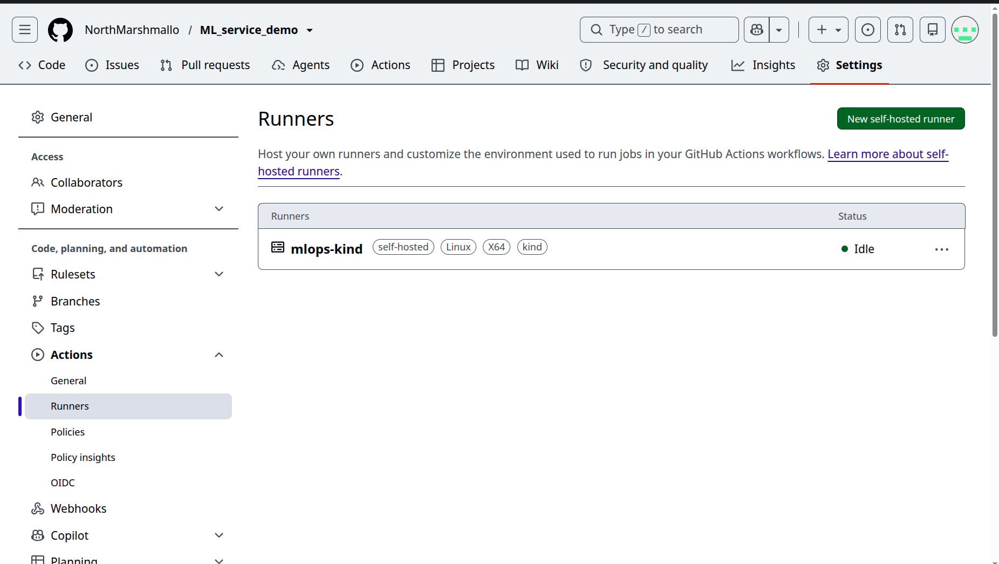

#### Деплой по кнопке

- [push в main](https://github.com/NorthMarshmallo/ML_service_demo/actions/runs/37224678012): `tests` и `build` прошли, образ в ghcr, `deploy` пропущен.
- [Run workflow](https://github.com/NorthMarshmallo/ML_service_demo/actions/runs/37225027125): тот же коммит, `deploy` запущен кнопкой (красный, см. [инцидент 2](#2-runner-не-видит-кластер)).

#### Версии данных в DVC

Датасет `datasets/dataset.csv` под DVC, в git только [`datasets/dataset.csv.dvc`](datasets/dataset.csv.dvc) с md5 и размером, сам CSV в `datasets/.gitignore`. Хранилище - папка `../dvc-storage` рядом с репозиторием.

| Версия данных | Строк | md5 | Что изменено |
|---|---|---|---|
| v1 | 17 000 | `96bb46abc7208090df46a3b35fc10687` | исходный датасет |
| v2 | 16 972 | `fbb751c61c3de006a7ffe188e3d84ddb` | убраны 20 полных дублей и 8 строк четырёх последовательностей, у которых в датасете два разных класса |

`dvc push` после каждой версии:

```
$ cat datasets/dataset.csv.dvc          # v1
outs:
- md5: 96bb46abc7208090df46a3b35fc10687
  size: 6011677
  hash: md5
  path: dataset.csv
$ uv run dvc push
1 file pushed
```

```
$ uv run dvc push                       # v2
1 file pushed
$ uv run dvc diff HEAD~1
Modified:
    datasets/dataset.csv

files summary: 1 modified
```

Откат к v1 и обратно: `wc -l` с заголовком.

```
$ git checkout HEAD~1 -- datasets/dataset.csv.dvc && uv run dvc checkout
M       datasets/dataset.csv
17001 datasets/dataset.csv
$ git checkout HEAD -- datasets/dataset.csv.dvc && uv run dvc checkout
M       datasets/dataset.csv
16973 datasets/dataset.csv
```

Чистый клон в соседней папке:

```
$ git clone -b feat/dvc-data ~/ML_Service_course ~/amr-dvc-check && cd ~/amr-dvc-check
$ uv run dvc pull
A       datasets/dataset.csv
1 file fetched and 1 file added
$ wc -l datasets/dataset.csv
16973 datasets/dataset.csv
```

Обучение на двух версиях: версии модели 1-4 обучены на v1 (`data_md5` `96bb46ab...`), версия 5 - на v2 (`data_md5` `fbb751c6...`). Гейт версию 5 не пропустил: macro F1 0.9533 против 0.9535 у champion, удаление 28 строк из 17 000 качество не изменило.

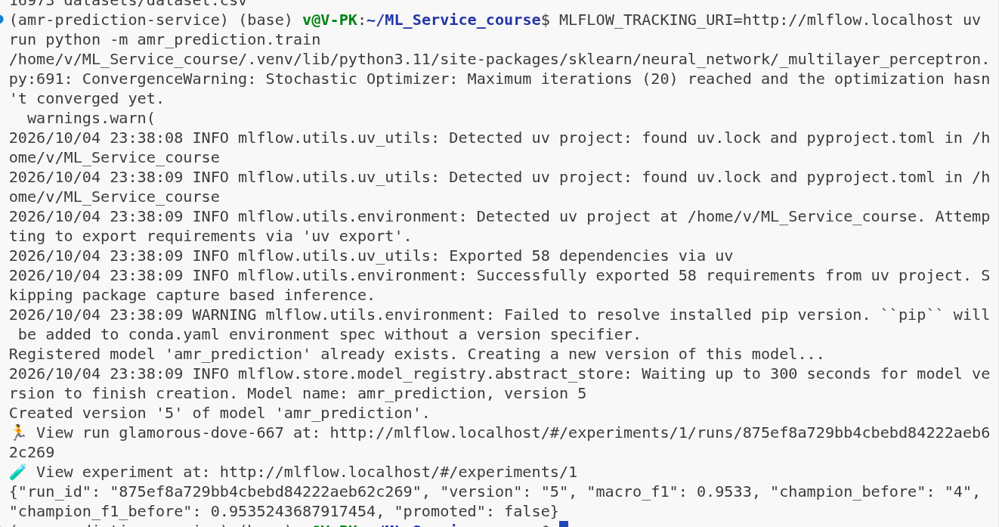

Сравнение прогонов версий 4 и 5 в MLflow: разные `data_md5` и `macro_f1`.

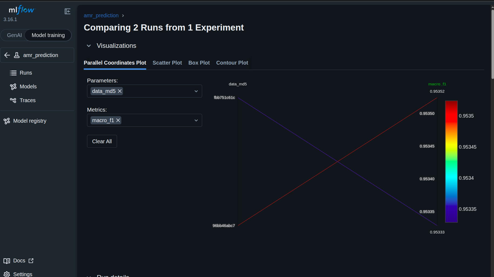

#### Автомасштабирование HPA

metrics-server из чарта `metrics-server/metrics-server` 3.14.0 с `--kubelet-insecure-tls` ([`platform/metrics-server-values.yaml`](platform/metrics-server-values.yaml)), HPA [`k8s/hpa.yaml`](k8s/hpa.yaml): 2-6 реплик, цель 60% CPU от `requests.cpu` 100m. Нагрузка - [`locustfile.py`](locustfile.py), POST `/v1/predict` со случайной последовательностью из `examples/sample_test_sequences.csv`, через Ingress `http://amr.localhost`.

| Пользователи | Длительность | Реплики | RPS | p50 | p95 | p99 | Ошибки | CPU на под | Postgres |
|---|---|---|---|---|---|---|---|---|---|
| 20 | 2 мин | 2 → 3 → 5 | 19.8 | 8 мс | 11 мс | 16 мс | 0 | 51-56m | 156m |
| 60 | 4 мин | 5 → 6 (`maxReplicas`) | 59.4 | 7 мс | 12 мс | 17 мс | 0 | 127-135m | 458m |
| 100 | 2 мин | 2 → 4 → 6 (`maxReplicas`) | 95.8 | 8 мс | 140 мс | 610 мс | 0 | 189-228m | 776m |

Прогон на 60 пользователей начат сразу после прогона на 20, на 5 репликах. На 100 пользователях первые 20 с, пока подов было 2-4, p95 доходил до 650 мс, после выхода на 6 подов к концу прогона упал до 150 мс. Без нагрузки поды берут 4m CPU.

События HPA (`kubectl describe hpa amr-prediction-service`):

```
SuccessfulRescale  New size: 3; reason: cpu resource utilization (percentage of request) above target
SuccessfulRescale  New size: 5; reason: cpu resource utilization (percentage of request) above target
SuccessfulRescale  New size: 4; reason: All metrics below target
SuccessfulRescale  New size: 2; reason: All metrics below target          (x3 over 28m)
SuccessfulRescale  New size: 4; reason: cpu resource utilization (percentage of request) above target  (x3 over 27m)
SuccessfulRescale  New size: 6; reason: cpu resource utilization (percentage of request) above target  (x4 over 37m)
```

При 6 репликах под нагрузкой: `ScalingLimited True TooManyReplicas` - HPA хотел больше, чем `maxReplicas`.

**Requests памяти.** Память пода от нагрузки почти не зависит: 176 Mi без нагрузки, максимум 182 Mi на 100 пользователях - модель загружается один раз при старте. 182 Mi + треть ≈ 240 Mi: `requests.memory` 256Mi → 240Mi, запрос был почти честным.

### Добавлено

- HPA по CPU (2-6 реплик, 60%), metrics-server для kind, locust через Ingress - [`k8s/hpa.yaml`](k8s/hpa.yaml), [`platform/metrics-server-values.yaml`](platform/metrics-server-values.yaml), [`locustfile.py`](locustfile.py)
- Датасет под DVC, хранилище `../dvc-storage`; вторая версия данных без дублей и противоречивых меток - [`datasets/dataset.csv.dvc`](datasets/dataset.csv.dvc)
- Кластер kind с пробросом `127.0.0.1:80` → NodePort 30080 - [`platform/kind-config.yaml`](platform/kind-config.yaml)
- Traefik (чарт `traefik-41.6.0`) как Ingress-контроллер на NodePort 30080 - [`platform/traefik-values.yaml`](platform/traefik-values.yaml)
- MLflow 3.16.1 в namespace `mlops`: SQLite и артефакты на PVC 2Gi - [`platform/mlflow.yaml`](platform/mlflow.yaml)
- Ingress `mlflow.localhost` → Service `mlflow:5000` - [`platform/ingress.yaml`](platform/ingress.yaml)
- Обучение с регистрацией в MLflow и гейтом по macro F1 (`MIN_GAIN` 0.005) - [`src/amr_prediction/train.py`](src/amr_prediction/train.py)
- Классы модели - фиксированный список `CLASSES` вместо «7 самых частых» при каждом обучении; обучение останавливается, если в классе меньше 100 примеров; число отброшенных строк по каждому фильтру пишется в метрики прогона
- В прогоне: матрица ошибок `confusion_matrix.png`, `metadata.json` с признаками и классами, параметр `data_md5`
- Сервис загружает `MODEL_NAME@MODEL_ALIAS` из реестра, без `MODEL_NAME` - бандл из файла; в `/health` версия из реестра - [`src/amr_prediction/model_store.py`](src/amr_prediction/model_store.py)
- Ingress `amr.localhost` → Service `amr-prediction-service:80` рядом с остальными манифестами сервиса - [`k8s/ingress.yaml`](k8s/ingress.yaml)
- Job `deploy` на self-hosted runner `[self-hosted, kind]` в кластер `mlops` вместо временного кластера в облаке; запуск только через `workflow_dispatch`, `concurrency` не пускает два деплоя сразу - [PR #26](https://github.com/NorthMarshmallo/ML_service_demo/pull/26)
- Secret через `--dry-run=client -o yaml | kubectl apply`: в постоянном кластере повторный `create secret` падал бы с `AlreadyExists` - [PR #26](https://github.com/NorthMarshmallo/ML_service_demo/pull/26)
- Smoke через Ingress: версия из реестра в `/health`, класс и `score` на `good.json`, строка в базе ровно с этим `request_id` - [PR #26](https://github.com/NorthMarshmallo/ML_service_demo/pull/26)
- ConfigMap: `MODEL_NAME`, `MODEL_ALIAS`, `MLFLOW_TRACKING_URI` - сервис в кластере берёт модель из реестра - [PR #26](https://github.com/NorthMarshmallo/ML_service_demo/pull/26), [PR #28](https://github.com/NorthMarshmallo/ML_service_demo/pull/28)

### Изменено

- TF-IDF обучается на train до upsampling, как в ноутбуке: upsampling меняет только данные для модели, а не статистику признаков
- `build` публикует образ при любом событии, кроме PR: на запуске по кнопке `deploy` тянет образ, собранный в том же прогоне - [PR #26](https://github.com/NorthMarshmallo/ML_service_demo/pull/26)

### Исправлено

- Smoke: POST `/v1/predict` с повторами и `-S`, ошибка `curl` видна в логе - [PR #30](https://github.com/NorthMarshmallo/ML_service_demo/pull/30)

### Инциденты

#### 1. kind load: образ MLflow не загружается в узел

- **Симптом:** `kind load docker-image ghcr.io/mlflow/mlflow:v3.16.1 --name mlops` падает на импорте в узел.
- **Ошибка:** `ctr ... images import --all-platforms ... failed`, `ctr: content digest sha256:03124d4b...: not found`
- **Диагностика:** падает containerd внутри узла, а не чтение образа на ноутбуке. Локально образ только `amd64`, а Docker 29 хранит образы в containerd image store (`docker info`: `io.containerd.snapshotter.v1`).
- **Причина:** образ мультиплатформенный, индекс ссылается на все платформы, а скачаны слои только `amd64`. kind импортирует с `--all-platforms` и не находит остальных.
- **Исправление:** `kind load` пропущен, узел сам скачал образ из ghcr за 25,7 с. Обход: `docker save --platform linux/amd64` + `kind load image-archive`.

#### 2. Runner не видит кластер

- **Симптом:** [первый запуск deploy](https://github.com/NorthMarshmallo/ML_service_demo/actions/runs/37225027125): job красный на шаге `kind, kubectl и доступ к кластеру`, дальше ни один шаг не выполнился.
- **Ошибка:** `ERROR: could not locate any control plane nodes for cluster named 'kind'. Use the --name option to select a different cluster`
- **Диагностика:** `kind export kubeconfig` ищет Docker-контейнер `<имя кластера>-control-plane`, и в ошибке названо имя, под которым он искал, - `kind`. Это имя по умолчанию, а кластер с платформой создан как `mlops` (`kind get clusters`, контейнер `mlops-control-plane`). Имя берётся из `KIND_CLUSTER` в `ci.yml`.
- **Причина:** `KIND_CLUSTER: kind` в `ci.yml`.
- **Исправление:** `KIND_CLUSTER: mlops` - [PR #27](https://github.com/NorthMarshmallo/ML_service_demo/pull/27)
- **Ссылки:** в [следующем прогоне](https://github.com/NorthMarshmallo/ML_service_demo/actions/runs/37226363958) шаг с кластером зелёный, прогон красный из-за инцидента 3

#### 3. Модели нет в реестре

- **Симптом:** [прогон](https://github.com/NorthMarshmallo/ML_service_demo/actions/runs/37226363958): job `deploy` красный на шаге `сервис`, новые поды в `CrashLoopBackOff`.
- **Ошибка:** шаг `сервис`: `Waiting for deployment "amr-prediction-service" rollout to finish: 1 out of 2 new replicas have been updated...` → `error: timed out waiting for the condition`. В логе пода: `mlflow.exceptions.RestException: RESOURCE_DOES_NOT_EXIST: Registered Model with name=churn not found`, `ERROR: Application startup failed. Exiting.`
- **Диагностика:** в events у нового пода `Container started`, затем `Startup probe failed: connection refused` и `Back-off restarting failed container api`: образ скачан, Secret найден, контейнер запускается и сам падает при старте. В traceback падение в `get_model_version_by_alias` из `model_store.py`: сервис спрашивает у реестра модель из `MODEL_NAME` и получает «не найдена». Поды в `ImagePullBackOff` с `amr_prediction-service:1.0` - это ReplicaSet до `kubectl set image`, к причине они не относятся.
- **Причина:** `MODEL_NAME: churn` в `k8s/configmap.yaml`, а модель в реестре называется `amr_prediction`.
- **Исправление:** `MODEL_NAME: amr_prediction` - [PR #28](https://github.com/NorthMarshmallo/ML_service_demo/pull/28)
- **Ссылки:** в [следующем прогоне](https://github.com/NorthMarshmallo/ML_service_demo/actions/runs/37229714127) шаг `сервис` зелёный, поды `Running`, прогон красный из-за инцидента 4

#### 4. Smoke: Ingress не находит хост

- **Симптом:** [прогон](https://github.com/NorthMarshmallo/ML_service_demo/actions/runs/37229714127): job `deploy` красный на шаге `smoke`, хотя `rollout status` прошёл и поды `Running`.
- **Ошибка:** шесть раз `curl: (22) The requested URL returned error: 404` - запрос и 5 повторов `--retry`.
- **Диагностика:** в логе пода только пробы `GET /health` и `GET /ready` от kubelet, запроса smoke там нет. Значит, 404 вернул не сервис, а Traefik, который не нашёл маршрута. Traefik выбирает маршрут по заголовку `Host`: в диагностике `kubectl get ingress -A` у сервиса хост `amr.localhost`, а smoke шлёт `Host: churn.localhost`.
- **Причина:** в шаге `smoke` в `ci.yml` хост `churn.localhost`, не совпадающий с `k8s/ingress.yaml`.
- **Исправление:** `Host: amr.localhost` - [PR #29](https://github.com/NorthMarshmallo/ML_service_demo/pull/29)
- **Ссылки:** в [следующем прогоне](https://github.com/NorthMarshmallo/ML_service_demo/actions/runs/37230172783) `/health` через Ingress ответил `amr_prediction-v4`, прогон красный из-за инцидента 5

#### 5. Smoke: запрос попал в завершающийся под

- **Симптом:** [прогон](https://github.com/NorthMarshmallo/ML_service_demo/actions/runs/37230172783) после починки инцидентов 2-4: шаг `smoke` красный, `/health` через Ingress ответил `amr_prediction-v4`, дальше пустая строка и `Error: Process completed with exit code 4`.
- **Диагностика:** код 4 у `jq -e` значит пустой вход, то есть `pred.json` пустой и POST не удался. Ошибку `curl` не видно: у него был только `-s`, а `bash -e` без `pipefail` не замечает ошибку команды перед `| tee`. Тот же POST с ноутбука через `amr.localhost` вернул `200`, в логах новых подов POST из CI нет. В events старые поды прошлого прогона удалялись (`Killing ... Stopping container api`) в ту же секунду, что шёл smoke.
- **Причина:** `rollout status` завершается, как только новые поды готовы, а старые ещё завершаются, и Traefik пару секунд держит их адреса в маршруте. `/health` прошёл за счёт `--retry`, POST без повторов попал в старый под.
- **Исправление:** у POST `--retry 5 --retry-all-errors` и `-S`. Повтор безопасен: в базе проверяется `request_id` из ответа, который в итоге пришёл - [PR #30](https://github.com/NorthMarshmallo/ML_service_demo/pull/30)
- **Ссылки:** [исправлено](https://github.com/NorthMarshmallo/ML_service_demo/actions/runs/37231251038)

#### 6. Сеть: runner теряет связь с GitHub

- **Симптом:** в [одном прогоне](https://github.com/NorthMarshmallo/ML_service_demo/actions/runs/37225399816) `deploy` упал на `docker/login-action`, ещё до шагов проекта; в [другом](https://github.com/NorthMarshmallo/ML_service_demo/actions/runs/37230794974) job повис на `Waiting for a runner`, а Cancel не срабатывал.
- **Ошибка:** `Get "https://ghcr.io/v2/": context deadline exceeded`; в `docker logs gh-runner`: `TaskCanceledException`, затем `acquirejob failed. HTTP Status: Conflict` и `Skipping message Job. Job message already acquired`.
- **Диагностика:** код workflow ни при чём: падает до первой команды проекта. В логе runner видно, что запрос на взятие job ушёл, ответ не дождался по таймауту, а повтор GitHub отклонил как уже взятый. GitHub считает job у runner, runner его не выполняет, поэтому отмена ждёт ответа, которого не будет. Запрос к api.github.com с машины в этот момент шёл 7 с вместо 0,3 с.
- **Причина:** нестабильная сеть до GitHub на машине с runner.
- **Исправление:** `docker restart gh-runner` (регистрация сохраняется: `config.sh` запускается только без файла `.runner`), GitHub закрыл зависший job как `cancelled`, [следующий запуск](https://github.com/NorthMarshmallo/ML_service_demo/actions/runs/37231251038) прошёл.

### Вопросы и решения

**Метрика гейта и `MIN_GAIN`.** Гейт сравнивает macro F1: классы несбалансированы, и accuracy держится за счёт частых классов, а macro F1 даёт каждому из 7 классов равный вес и падает, если модель проваливает редкий класс. `MIN_GAIN` 0.005: на тесте около 3 000 последовательностей разница меньше полупроцента может получиться от другого seed, гейт должен пропускать заметное улучшение, а не шум.

**1. Почему tests и build идут в облаке GitHub, а deploy не может, какие ещё есть способы доставить код в кластер за NAT и почему выбран runner.**

tests и build ничего не знают о кластере: им нужны только код, Postgres-сервис в job и ghcr, всё это доступно из облака. Кластер `mlops` живёт на ноутбуке: API-сервер kind опубликован только на `127.0.0.1` ноутбука, Ingress - на `127.0.0.1:80`, сам ноутбук за NAT, и облачная машина GitHub до него не достучится. Другие способы: открыть API-сервер наружу через туннель (ngrok, cloudflared) или VPN (Tailscale) - тогда в интернете торчит доступ ко всему кластеру; pull-подход GitOps - Argo CD или Flux внутри кластера сами забирают манифесты из git, входящие подключения не нужны, но это ещё один компонент в кластере. Runner выбран, потому что он сам подключается к GitHub исходящим HTTPS и забирает задания, входящие порты не открываются, а job `deploy` остаётся обычным шагом того же `ci.yml` с теми же логами и секретами.

**2. Зачем runner запущен с `--network kind`, сокетом Docker и `--group-add`, и что сломается без каждого.**

- `--network kind` - контейнер runner в той же Docker-сети, что и узел `mlops-control-plane`, и видит его по имени: `kind export kubeconfig --internal` пишет адрес API `https://mlops-control-plane:6443`, а smoke ходит на `mlops-control-plane:30080`. Без этого имя не резолвится, `kubectl get nodes` и smoke падают.
- Сокет `/var/run/docker.sock` - runner управляет Docker ноутбука: `docker pull` образа из ghcr, `kind load docker-image` (сохраняет образ и импортирует его в контейнер узла), `kind export kubeconfig` находит узел среди контейнеров Docker. Без сокета `Cannot connect to the Docker daemon`, и kind не видит ни одного кластера.
- `--group-add` - сокет на хосте `srw-rw---- root:983`, писать в него может только root или группа 983 (`docker` на этом Linux), а runner работает от пользователя `runner` (uid 1001). Поэтому runner запущен с `--group-add 983`, в `id` внутри контейнера видна группа 983. В задании `--group-add 0`, потому что в Docker Desktop сокет принадлежит группе root. Без этого флага `permission denied while trying to connect to the Docker daemon socket`.

**3. Почему `create secret` заменили на `--dry-run=client -o yaml | kubectl apply`, и что будет при втором деплое без этой замены.**

Раньше deploy каждый раз создавал новый пустой kind в облаке, и `create secret` всегда создавал Secret впервые. Кластер `mlops` постоянный: после первого деплоя Secret `amr-prediction-secrets` в нём уже есть, и второй `kubectl create secret` падает с `Error from server (AlreadyExists): secrets "amr-prediction-secrets" already exists`, шаг `подтягиваем секреты` красный на каждом деплое после первого. `--dry-run=client -o yaml` только печатает манифест Secret, ничего не отправляя в кластер, а `kubectl apply` создаёт его, если нет, и обновляет, если есть. Заодно новый пароль из GitHub Secrets при следующем деплое попадает в кластер, а не игнорируется.

**4. Чем challenger отличается от champion, почему сервис просит алиас, а не номер версии, и чем откат модели через алиас отличается от отката кода через `rollout undo`.**

`challenger` всегда стоит на последней обученной версии, `champion` - на той, что прошла гейт и обслуживает запросы. Сервис просит `@champion`, потому что номер версии пришлось бы менять в конфиге и выкатывать заново, а алиас переезжает в реестре, и сервис подхватывает его при следующем старте. Откат модели - перевесить `champion` на прошлую версию и перезапустить поды, образ не меняется. `rollout undo` возвращает прошлый образ, то есть прошлый код, а модель останется той, на которую указывает алиас.

**5. Что будет, если задеплоить сервис в кластер, где никто ещё не обучил модель, и как это увидеть в k9s и в логе CI.**

Сервис на старте спрашивает реестр `amr_prediction@champion`, получает `RESOURCE_DOES_NOT_EXIST: Registered Model with name=amr_prediction not found` и завершается с `Application startup failed`. Kubernetes перезапускает контейнер по кругу: в k9s поды `0/1`, статус `CrashLoopBackOff`, счётчик RESTARTS растёт, в логах пода (`l`) traceback из `model_store.py`. В CI шаг `сервис` падает по таймауту `rollout status` (`error: timed out waiting for the condition`), а в шаге `диагностика` в логе пода та же ошибка. Ровно это произошло в [инциденте 3](#3-модели-нет-в-реестре), только с несуществующим именем `churn` вместо необученной модели. Если в кластере уже работали старые поды, rolling update их не тронет, пока новые не станут готовы, и старая версия продолжит отвечать; при первом деплое сервиса просто не будет.

**6. Путь запроса от браузера до пода MLflow, зачем `--allowed-hosts` и `--cors-allowed-origins`, почему порт 80 задаётся при создании кластера.**

`mlflow.localhost` резолвится в `127.0.0.1`, на порту 80 слушает Docker и пересылает на узел `172.19.0.2:30080`. Там NodePort передаёт запрос в под Traefik (`:8000`), Traefik по заголовку `Host` находит Ingress и отправляет в под MLflow (`10.244.0.6:5000`). MLflow 3 отвечает 403 на незнакомый `Host`, поэтому в `--allowed-hosts` все имена, по которым к нему приходят (`mlflow.localhost`, `mlflow.mlops`, `localhost`), а без `--cors-allowed-origins` UI на `http://mlflow.localhost` показывает `Failed to load`. Порт 80 задаётся при создании, потому что узел kind - Docker-контейнер, а порты контейнера публикуются только при его запуске.

**7. Сколько реплик HPA должен был выставить по формуле и почему вниз реплики уходят дольше, чем вверх.**

Формула: `desired = ceil(current × текущая загрузка / целевая)`, загрузка - доля от `requests.cpu` 100m. На 20 пользователях 5 подов по ~53m, то есть суммарно ~265m. На 2 подах это 132% на под: `ceil(2 × 132 / 60) = 5` - ровно столько HPA и выставил (через 3, пока locust набирал пользователей). На 60 пользователях ~790m суммарно, на 5 подах 158%: `ceil(5 × 158 / 60) = 14`, на 100 пользователях ~1270m: `ceil(1270 / 60) = 22`. В обоих случаях упор в `maxReplicas: 6`, в условиях HPA `TooManyReplicas`. Вниз реплики уходили примерно через 5 минут после конца нагрузки: у scale down окно стабилизации 300 с, HPA берёт максимальную рекомендацию за это окно и не убирает поды на каждом провале нагрузки. У scale up окна нет, поэтому рост идёт сразу.

**8. Что лежит в git, а что в хранилище DVC, и как восстановить ровно те данные, на которых обучена версия N модели.**

В git: код, `datasets/dataset.csv.dvc` (md5, размер и путь файла), `.dvc/config` с адресом хранилища и `datasets/.gitignore`, который не пускает CSV в git. В хранилище `../dvc-storage` сами файлы, разложенные по md5: `files/md5/96/bb46...` (v1) и `files/md5/fb/b751...` (v2). Восстановление данных версии N:

1. MLflow → Model registry → `amr_prediction` → версия N → её прогон → параметр `data_md5`. Например, у версии 5 `fbb751c61c3de006a7ffe188e3d84ddb`.
2. Найти коммит, где `.dvc`-файл с этим md5: `git log -S fbb751c61c3de006a7ffe188e3d84ddb --oneline -- datasets/dataset.csv.dvc` → `f32a35f data v2: ...`.
3. Взять `.dvc`-файл из этого коммита и данные под него: `git checkout f32a35f -- datasets/dataset.csv.dvc && uv run dvc pull`.
4. Проверить: `md5sum datasets/dataset.csv` совпадает с `data_md5` в прогоне.
5. Вернуть текущую версию: `git checkout HEAD -- datasets/dataset.csv.dvc && uv run dvc checkout`.

Упрощение: прогон хранит только md5 данных, коммит ищется поиском по истории. Надёжнее писать в прогон ещё и git-коммит.

## [0.2.0] - 2026-09-27 - CI/CD

Пайплайн [`.github/workflows/ci.yml`](.github/workflows/ci.yml):

```
PR:    tests (ruff + pytest с Postgres) → build (сборка образа без публикации)
main:  tests → build (образ в ghcr, тег sha-<коммит>) → deploy (kind + манифесты + smoke)
```

### Добавлено

- CI: job `tests` (ruff + pytest с Postgres) и `build` (образ в ghcr) - [PR #11](https://github.com/NorthMarshmallo/ML_service_demo/pull/11)
- Postgres и ConfigMap в Kubernetes, подключение ConfigMap и Secret в Deployment - [PR #13](https://github.com/NorthMarshmallo/ML_service_demo/pull/13)
- Job `deploy`: kind-кластер, Secret из GitHub Secrets, выкат, smoke, шаг диагностики - [PR #14](https://github.com/NorthMarshmallo/ML_service_demo/pull/14)
- Проверка, что секрет `DB_PASSWORD` задан; в диагностике логи Postgres и ресурсы ноды - [PR #18](https://github.com/NorthMarshmallo/ML_service_demo/pull/18), [PR #19](https://github.com/NorthMarshmallo/ML_service_demo/pull/19)
- `model_path` в `/health`: значение `MODEL_PATH` из ConfigMap видно снаружи ([вывод в smoke](https://github.com/NorthMarshmallo/ML_service_demo/actions/runs/36316061311/job/108611017428#step:10:1)) - [PR #20](https://github.com/NorthMarshmallo/ML_service_demo/pull/20)
- Smoke проверяет, что `model_path` в `/health` совпадает с ConfigMap, `score` в диапазоне `[0, 1]` и предсказание записалось в базу; расширен pytest-smoke - [PR #21](https://github.com/NorthMarshmallo/ML_service_demo/pull/21)

### Исправлено

- Гонка при создании таблицы двумя репликами приложения: `pg_advisory_xact_lock` в `init()` - [PR #13](https://github.com/NorthMarshmallo/ML_service_demo/pull/13)

### Инциденты

#### 1. Опечатка в версии action

- **Симптом:** [Feat/ci #1](https://github.com/NorthMarshmallo/ML_service_demo/actions/runs/36047861028): job `tests` красный на шаге `Set up job`, ни один шаг workflow не выполнился.
- **Ошибка:** ``Unable to resolve action `astral-sh/setup-uv@7`, unable to find version `7` ``
- **Диагностика:** на шаге `Set up job` GitHub только скачивает actions, код ещё не запускается, значит, проблема в самом `ci.yml`. В сообщении названы action и версия, которую не удалось найти. В репозитории `astral-sh/setup-uv` теги начинаются с `v` (`v7`), тега `7` нет.
- **Причина:** в `uses:` указана версия `@7` вместо `@v7`.
- **Исправление:** `astral-sh/setup-uv@v7` - [822a734](https://github.com/NorthMarshmallo/ML_service_demo/commit/822a734)
- **Ссылки:** [исправлено](https://github.com/NorthMarshmallo/ML_service_demo/actions/runs/36112921149)

#### 2. Не задан секрет DB_PASSWORD

- **Симптом:** четыре прогона `main` подряд, последний - [Merge pull request #17](https://github.com/NorthMarshmallo/ML_service_demo/actions/runs/36310218225): job `deploy` красный на шаге `база`, под Postgres в статусе `CrashLoopBackOff`.
- **Ошибка:** шаг `база`: `Waiting for deployment "postgres" rollout to finish: 0 of 1 updated replicas are available...` → `error: timed out waiting for the condition`. Диагностика: `postgres-559d895d99-hc87n   0/1   CrashLoopBackOff   4 (75s ago)`, в events `Readiness probe errored ... container is in CONTAINER_EXITED state` и `Back-off restarting failed container postgres`.
- **Диагностика:** под Postgres назначен на ноду и образ скачан, но контейнер сразу после старта завершается (`CONTAINER_EXITED`), и кубер перезапускает его по кругу (4 рестарта). Значит, падает сам процесс Postgres при старте, и дело в его настройках, а не в ресурсах или образе. Единственная настройка, которую ему передаёт пайплайн, - пароль из секрета. Строка `deployments.apps "amr-prediction-service" not found` к причине не относится: шаг `база` упал раньше, чем `kubectl apply -f k8s/` создал Deployment приложения. Логов Postgres в диагностике тогда не было, поэтому в неё добавлен `kubectl logs deploy/postgres`. 
- **Причина:** секрет `DB_PASSWORD` не был задан в настройках репозитория. `${{ secrets.DB_PASSWORD }}` вернул пустую строку, пайплайн создал Secret с пустым `POSTGRES_PASSWORD`, а образ `postgres` при первом запуске без пароля завершается с ошибкой.
- **Исправление:** секрет `DB_PASSWORD` задан в Settings → Secrets and variables → Actions; шаг создания секрета падает с понятным сообщением, если он пустой; в диагностику добавлены логи Postgres - [654203d](https://github.com/NorthMarshmallo/ML_service_demo/commit/654203d), [PR #18](https://github.com/NorthMarshmallo/ML_service_demo/pull/18)
- **Ссылки:** после починки шаг `база` [зелёный](https://github.com/NorthMarshmallo/ML_service_demo/actions/runs/36311768026) (прогон красный из-за инцидента 3). Параллельно исправлена ошибочно предполагаемая первопричинной проблема именования [secretRef](https://github.com/NorthMarshmallo/ML_service_demo/actions/runs/36309542257)

#### 3. Ресурсы: память, которой нет на узле

- **Симптом:** [Merge pull request #18](https://github.com/NorthMarshmallo/ML_service_demo/actions/runs/36311768026): job `deploy` красный на шаге `сервис`, `rollout status deploy/amr-prediction-service` не дождался готовности за 120 с. Все три пода приложения в статусе `Pending`, Postgres в `Running`.
- **Ошибка:** `Warning FailedScheduling pod/amr-prediction-service-7554df795c-59g7r 0/1 nodes are available: 1 Insufficient memory. no new claims to deallocate, preemption: 0/1 nodes are available: 1 Preemption is not helpful for scheduling.`
- **Диагностика:** в `kubectl get pods` у подов приложения `NODE <none>` и `IP <none>`, то есть их не назначили ни на одну ноду, и до запуска контейнера дело не дошло. В events у каждого пода `FailedScheduling ... Insufficient memory`: scheduler не нашёл ноду с нужным объёмом памяти. Postgres на той же ноде работает, значит, дело не в ноде, а в том, сколько памяти просит приложение, то есть в `resources.requests` в `k8s/deployment.yaml`.
- **Причина:** `memory: 1000000000Mi` в `requests` и `limits` в `k8s/deployment.yaml`.
- **Исправление:** `requests: 256Mi`, `limits: 512Mi`; в диагностику добавлен вывод выделенных ресурсов ноды - [062f412](https://github.com/NorthMarshmallo/ML_service_demo/commit/062f412), [PR #19](https://github.com/NorthMarshmallo/ML_service_demo/pull/19)
- **Ссылки:** после починки поды назначены на ноду, [следующий прогон](https://github.com/NorthMarshmallo/ML_service_demo/actions/runs/36312800992) красный из-за инцидента 4

#### 4. Конфиг: путь к несуществующей модели

- **Симптом:** [Merge pull request #19](https://github.com/NorthMarshmallo/ML_service_demo/actions/runs/36312800992): job `deploy` красный на шаге `сервис`. `rollout status` напечатал `Waiting for deployment "amr-prediction-service" rollout to finish: 1 out of 2 new replicas have been updated...` и `error: timed out waiting for the condition`. Новый под приложения в `CrashLoopBackOff` (в events `Back-off restarting failed container api`).
- **Ошибка:** `FileNotFoundError: [Errno 2] No such file or directory: 'artifact/model.joblib'`, затем `ERROR: Application startup failed. Exiting.`
- **Диагностика:** в events у нового пода (образ из ghcr) `Container started`, а через несколько секунд `Back-off restarting failed container`: контейнер запускается и сам падает, значит, образ скачан и Secret найден, а ломается код при старте. Поды в `ImagePullBackOff` с образом `amr_prediction-service:1.0` - это старый ReplicaSet до `kubectl set image`, к причине они не относятся. В логе упавшего контейнера traceback на `joblib.load(settings.model_path)` и путь `artifact/model.joblib`. Путь берётся из ConfigMap, и в образе такого файла нет.
- **Причина:** `MODEL_PATH: artifact/model.joblib` в `k8s/configmap.yaml`, но в образе файл `artifact/amr_prediction_bundle.joblib`.
- **Исправление:** `MODEL_PATH: artifact/amr_prediction_bundle.joblib` - [f549ed0](https://github.com/NorthMarshmallo/ML_service_demo/commit/f549ed0), [PR #20](https://github.com/NorthMarshmallo/ML_service_demo/pull/20)
- **Ссылки:** [исправлено](https://github.com/NorthMarshmallo/ML_service_demo/actions/runs/36314063743)

#### 5. Неверный ожидаемый класс в pytest-smoke

- **Симптом:** [Test/smoke model path #23](https://github.com/NorthMarshmallo/ML_service_demo/actions/runs/36315887818): job `tests` красный на шаге `Run uv run pytest`, build и deploy пропущены.
- **Ошибка:** `FAILED tests/test_smoke.py::test_predict_smoke - AssertionError: assert 'multidrug' == 'aminoglycoside'`
- **Диагностика:** упал только один тест, и только на сравнении класса. Предыдущие проверки в том же тесте (класс из списка `classes`, `score` в допустимом диапазоне) прошли, значит, модель работает, а ответ отличается от ожидаемого. Ожидаемое значение `aminoglycoside` было взято из ответа сервиса на `good.json`, а тест отправляет фикстуру `good_row` из `tests/conftest.py`.
- **Причина:** в `good.json` и в фикстуре `good_row` разные последовательности. Для `good_row` модель предсказывает `multidrug`, а в тест записан класс для `good.json`.
- **Исправление:** ожидаемый класс заменён на `multidrug` - [18d586d](https://github.com/NorthMarshmallo/ML_service_demo/commit/18d586d), [PR #21](https://github.com/NorthMarshmallo/ML_service_demo/pull/21)
- **Ссылки:** [исправлено](https://github.com/NorthMarshmallo/ML_service_demo/actions/runs/36316005849)

### Вопросы и решения

**1. Сколько секунд шёл build в первом и во втором прогоне, какой слой взят из кэша и почему.**

Кэш слоёв используется на шаге `docker/build-push-action` job-а build: buildx читает его из кэша GitHub Actions (`cache-from: type=gha`) и записывает обратно (`cache-to`).

| Прогон build | Job | Сборка образа | Кэш |
|---|---|---|---|
| 1. [PR #11](https://github.com/NorthMarshmallo/ML_service_demo/actions/runs/36182576138) | 43 с | 33 с | пусто, первый прогон build |
| 2. [push в main, PR #11](https://github.com/NorthMarshmallo/ML_service_demo/actions/runs/36182821910) | 61 с | 44 с (+ публикация в ghcr) | кэш из PR недоступен в `main` |
| 3. [PR #13](https://github.com/NorthMarshmallo/ML_service_demo/actions/runs/36255139460) | 22 с | 11 с | кэш из `main`, изменён `src/` |
| 4. [PR #14](https://github.com/NorthMarshmallo/ML_service_demo/actions/runs/36284531786) | 14 с | 2 с | всё из кэша, образ не менялся |

Первые два прогона кэшем воспользоваться не могли. В первом кэша ещё не было. Второй шёл в `main`, а GitHub не даёт `main` читать кэш, записанный в PR-ветке (ветки видят кэш `main`, но не наоборот). Поэтому второй прогон тоже собирал всё с нуля и был дольше первого за счёт публикации образа.

Впервые кэш сработал в прогоне 3. В PR #13 менялся только `src/amr_prediction/db.py`, поэтому из кэша взяты все слои до `COPY src/ src/`, главный из них - установка зависимостей `RUN uv sync --frozen --no-dev --no-install-project`. Docker берёт слой из кэша, если не изменились ни его входные данные, ни предыдущие слои, а перед установкой зависимостей копируются только `pyproject.toml` и `uv.lock`. Начиная с `COPY src/ src/`, слои пересобраны. Для этого `Dockerfile` и копирует файлы зависимостей отдельно от кода: зависимости меняются редко, код часто.

У шага 5 нет пометки `CACHED`, но uv не запускался: вместо вывода установки (`Installed N packages`) под ним скачивается и распаковывается слой, записанный в кэш прогоном 2. Следующий шаг `COPY src/ src/` нужно было выполнить, поэтому buildkit скачал готовые слои, а не просто отметил их как `CACHED`:

```
#12 [stage-0 4/8] COPY pyproject.toml uv.lock ./
#12 CACHED

#13 [stage-0 5/8] RUN uv sync --frozen --no-dev --no-install-project
#13 sha256:f1c23b2c0195c5f07aacf59459a83c4c198e5f6cce53853271aafd58588860fe 118.75MB / 118.75MB 2.1s done
#13 extracting sha256:f1c23b2c0195c5f07aacf59459a83c4c198e5f6cce53853271aafd58588860fe 3.8s done
#13 DONE 6.7s
```

**2. Откуда поды в ImagePullBackOff при зелёном прогоне.**

`kubectl apply -f k8s/` сначала создаёт Deployment с образом из файла, `amr_prediction-service:1.0`. В kind такого образа нет, поэтому кубер пытается скачать его из Docker Hub, не может, и поды уходят в `ImagePullBackOff`. Сразу после этого `kubectl set image` подставляет образ из ghcr. Шаблон пода меняется, и Deployment создаёт новый ReplicaSet, а поды старого удаляет. `rollout status` ждёт именно новые поды, поэтому прогон зелёный: поды в `ImagePullBackOff` - временные остатки первой версии Deployment.

**3. Путь пароля базы и почему не в configmap.yaml.**

1. **GitHub.** Пароль хранится в секрете репозитория `DB_PASSWORD` (Settings → Secrets and variables → Actions). В коде его нет.
2. **Раннер CI.** В шаге `подтягиваем секреты` job-а deploy `DB_PASSWORD: ${{ secrets.DB_PASSWORD }}` кладёт его в переменную окружения этого шага. В логах он заменяется на `***`.
3. **Secret в кластере.** Тот же шаг выполняет `kubectl create secret generic amr-prediction-secrets` с двумя ключами: `POSTGRES_PASSWORD` (сам пароль) и `DATABASE_URL` (строка подключения, в которую пароль подставлен).
4. **Поды.**
   - Postgres (`k8s/postgres.yaml`) берёт ключ `POSTGRES_PASSWORD` через `secretKeyRef` и при первом запуске задаёт этот пароль пользователю `postgres`.
   - Приложение (`k8s/deployment.yaml`) через `envFrom: secretRef` получает все ключи Secret как переменные окружения. `DATABASE_URL` читается в `settings.database_url`, и по нему `psycopg` подключается к базе.

В `configmap.yaml` пароль класть нельзя: файл лежит в git, и пароль увидел бы любой, у кого есть доступ к репозиторию. Он остался бы в истории коммитов навсегда, даже после удаления. Кроме того, ConfigMap показывается в `kubectl describe` открытым текстом, а доступ к Secret в кластере можно ограничить отдельно.

**4. Что будет без `needs: tests` у build.**

build запустится параллельно с tests и не будет ждать результата. Например, в сценарий «в коммите сломана валидация входа, pytest красный, но сервис запускается» build всё равно соберёт и опубликует образ, deploy (он ждёт только build) выкатит его, smoke с корректным `good.json` пройдёт. В итоге в кластере окажется версия, которую тесты забраковали, а в ghcr - образ, который выглядит как рабочий.

**5. Почему на PR не нужны build и deploy.**

На PR сейчас добавлены tests и build, но build только собирает образ и не публикует его: `push: ${{ github.event_name == 'push' }}` в build (и `if: github.event_name == 'push'` у логина в ghcr). Так ошибки в `Dockerfile` видны ещё в PR, а в реестр попадают только образы с кодом, прошедшим ревью. Deploy не бежит на PR благодаря `if: github.event_name == 'push'` у job deploy: хотим выкатывать только то, что влито, а не промежуточные коммиты ветки.

**6. Зачем в `init()` `pg_advisory_xact_lock`.**

Реплики здесь - это два пода приложения из Deployment `amr-prediction-service` (`replicas: 2`), а не реплики базы. База одна, оба пода - её клиенты. При старте каждый под вызывает `init()`, а тот выполняет `CREATE TABLE IF NOT EXISTS`. На пустой базе поды стартуют одновременно: оба видят, что таблицы нет, и оба начинают её создавать. `IF NOT EXISTS` не защищает от такой гонки, и один из подов падает с `UniqueViolation` (`duplicate key value violates unique constraint "pg_type_typname_nsp_index"`), после чего перезапускается. Блокировка выстраивает их в очередь: второй под ждёт, пока первый создаст таблицу, и затем ничего не делает.

**7. Статусы подов в порядке жизни пода.**

Прежде чем процесс начнёт работать, под проходит три этапа. На каждом он может остановиться, и статус в `kubectl get pods` показывает, на каком именно.

1. **Планирование.** Scheduler выбирает ноду, где хватает ресурсов под `requests`. Если такой нет, под остаётся в `Pending`, в events `FailedScheduling`. У пода нет ни ноды, ни IP.
   *Инцидент с ресурсами:* `memory: 1000000000Mi` → `Pending`, `0/1 nodes are available: 1 Insufficient memory`.
2. **Подготовка контейнера на ноде.** Kubelet скачивает образ и собирает переменные окружения из ConfigMap и Secret. Если образа нет - `ErrImagePull` / `ImagePullBackOff`, если нет ConfigMap, Secret или ключа в них - `CreateContainerConfigError`. Контейнер не создаётся.
   *Инцидент с секретом:* в `secretRef` имя, которого пайплайн не создаёт → `CreateContainerConfigError`.
3. **Запуск процесса.** Контейнер стартует и запускает `CMD`. Если процесс завершается с ошибкой, kubelet перезапускает его с растущей паузой - `CrashLoopBackOff`, причина видна в логах контейнера.
   *Инцидент с конфигом:* неверный `MODEL_PATH` → `FileNotFoundError` при загрузке модели → `CrashLoopBackOff`.

Инциденты проявляются по очереди: пока под не прошёл этап, до следующей проверки дело не доходит.

## [0.1.0] - 2026-09-25 - сервис в Kubernetes локально

### Добавлено

- FastAPI-сервис: `/health`, `/ready`, `/v1/predict`; модель scikit-learn - [PR #1](https://github.com/NorthMarshmallo/ML_service_demo/pull/1), [PR #2](https://github.com/NorthMarshmallo/ML_service_demo/pull/2), [PR #3](https://github.com/NorthMarshmallo/ML_service_demo/pull/3)
- Логирование предсказаний в PostgreSQL - [PR #4](https://github.com/NorthMarshmallo/ML_service_demo/pull/4)
- Тесты - [PR #5](https://github.com/NorthMarshmallo/ML_service_demo/pull/5)
- Dockerfile и compose (сервис + Postgres) - [PR #6](https://github.com/NorthMarshmallo/ML_service_demo/pull/6)
- Манифесты Deployment (2 реплики, пробы, ресурсы) и Service - [PR #7](https://github.com/NorthMarshmallo/ML_service_demo/pull/7)
- `.dockerignore` - [PR #9](https://github.com/NorthMarshmallo/ML_service_demo/pull/9)
- `/ready` - [PR #10](https://github.com/NorthMarshmallo/ML_service_demo/pull/10)
- Валидация `sequence`, логирование 422 в таблицу, `uv sync --frozen` в Dockerfile - [PR #12](https://github.com/NorthMarshmallo/ML_service_demo/pull/12)

### Проверка

#### pytest

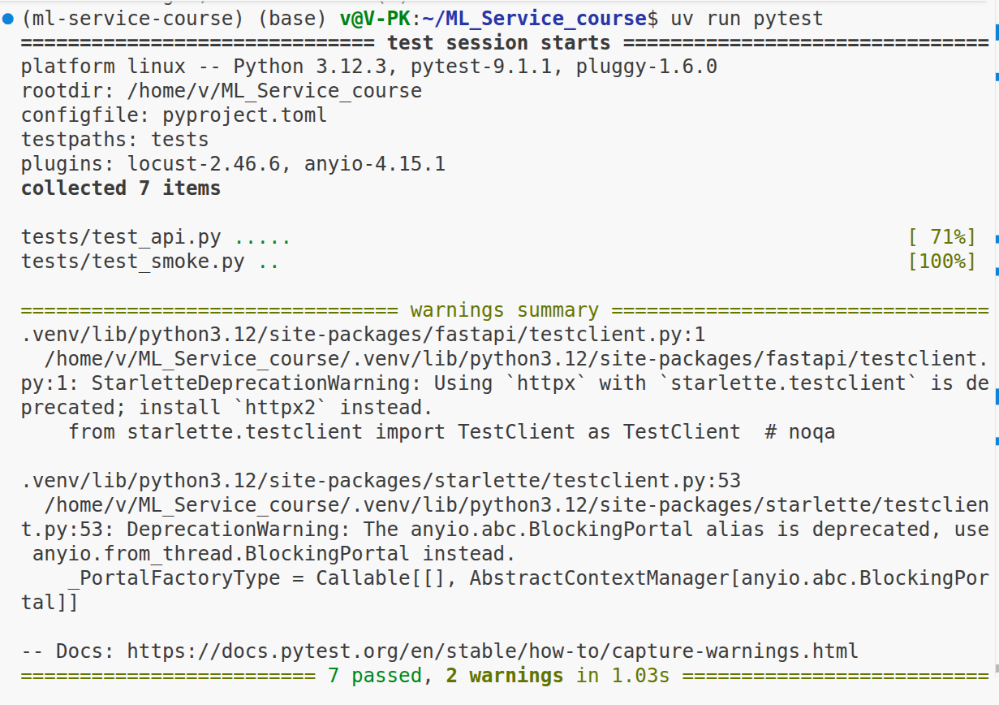

#### SELECT из таблицы логов

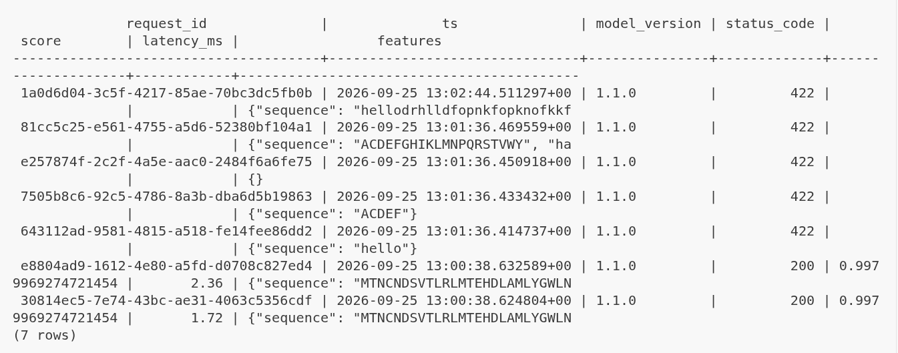

#### kubectl get pods и ответ /v1/predict через port-forward

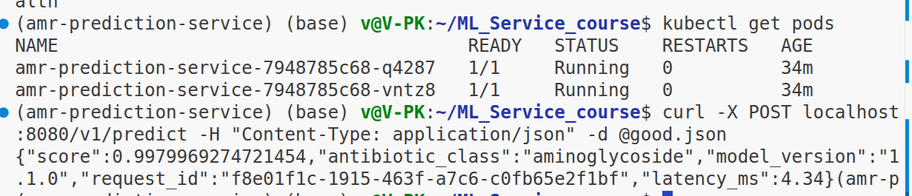

#### k9s

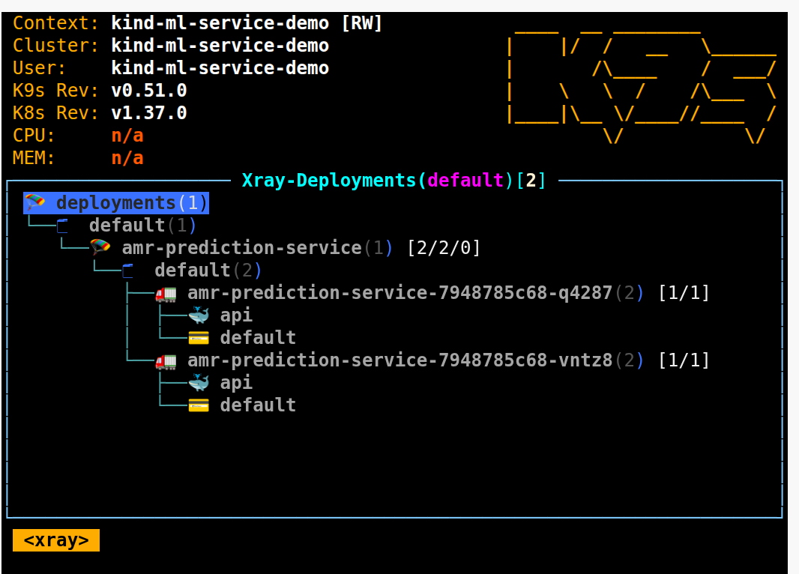

### Инциденты

#### 1. Артефакт модели не загружался через joblib

- **Симптом:** сервис не мог загрузить `artifact/amr_prediction_bundle.joblib`.
- **Ошибка:** `AttributeError: Can't get attribute 'integer_encoding' on <module '__main__' (<class '_frozen_importlib.BuiltinImporter'>)>`. Для torch-части: `ModuleNotFoundError: No module named 'torch'`.
- **Причина:** токенайзер `integer_encoding` и класс `MLPModel` (`torch.nn.Module`) были объявлены в ноутбуке. pickle сохраняет только путь к ним (`__main__.integer_encoding`), а не код.
- **Исправление:** отказ от кастомного кода в пайплайне. `MLPModel` заменена на `sklearn.neural_network.MLPClassifier` (те же слои, оптимизатор, batch size и seed), а кастомный токенайзер на `TfidfVectorizer(analyzer='char')`. Модель переобучена, бандл пересохранён (коммит `refactor: replace torch MLP with sklearn MLPClassifier, char-level TfidfVectorizer`).

#### 2. TLS handshake timeout при сборке образа

- **Симптом:** сборка не смогла скачать базовый образ `python:3.11-slim`.
- **Ошибка:** `failed to fetch anonymous token: Get "https://auth.docker.io/token?...": net/http: TLS handshake timeout`
- **Диагностика:** из shell `curl` до `auth.docker.io` вернул 200, до `registry-1.docker.io/v2/` вернул 401 (это нормальный ответ без авторизации). Прокси и `daemon.json` не настроены, Dockerfile корректен.
- **Причина:** временная сетевая проблема между демоном Docker и Docker Hub.
- **Исправление:** повторная сборка.

#### 3. kubectl apply: недопустимое имя ресурса

- **Симптом:** `kubectl apply -f k8s/` отклонил Deployment.
- **Ошибка:** `The Deployment "amr_prediction-service" is invalid: metadata.name: Invalid value: "amr_prediction-service": a lowercase RFC 1123 subdomain must consist of lower case alphanumeric characters, '-' or '.' ...`
- **Причина:** в именах ресурсов Kubernetes недопустим `_`.
- **Исправление:** в `metadata.name` у Deployment и Service `_` заменён на `-` (`amr-prediction-service`).

#### 4. Поды в Pending

- **Симптом:** `kubectl get pods` показывал `0/1 Pending` у всех подов, Deployment `0/2`.
- **Ошибка:** `FailedScheduling ... 0/1 nodes are available: 1 Insufficient memory.`
- **Причина:** в `requests` запрошено больше памяти, чем есть на ноде.
- **Исправление:** `1000Mi` в `requests` и `limits`, `kubectl apply -f k8s/`. Оба пода перешли в `Running`.

[Unreleased]: https://github.com/NorthMarshmallo/ML_service_demo/compare/v0.2.0...HEAD
[0.2.0]: https://github.com/NorthMarshmallo/ML_service_demo/compare/v0.1.0...v0.2.0
[0.1.0]: https://github.com/NorthMarshmallo/ML_service_demo/releases/tag/v0.1.0
